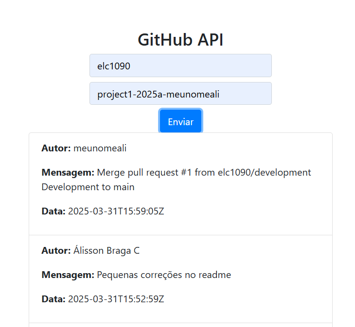

# Projeto2a: GitHub API e DOM Manipulation

#### Deploy

https://elc1090.github.io/project2a-2025a-meunomeali/github-api-tutorial-main/index.html

#### Desenvolvedor(a)

Álisson Braga Canabarro

#### Ambiente de desenvolvimento

- VS Code

#### Créditos

- [Tutorial](https://codesnippet.io/github-api-tutorial/) utilizado.

#### Bastidores

Foi uma atividade simples, mas acabei levando um tempo para descobrir como fazer o que foi pedido.  
Por exemplo, uma das requisições era:
`Adicionar mais um campo no formulário: repositório`
Eu não sabia como era o funcionamento de um formulário, então eu estava tentando adicionar um segundo formulário apenas para o nome do repositório, depois que eu fui entender como adicionar mais de um campo de texto no mesmo formulário.

---
Projeto entregue para a disciplina de [Desenvolvimento de Software para a Web](http://github.com/andreainfufsm/elc1090-2025a) em 2025a
